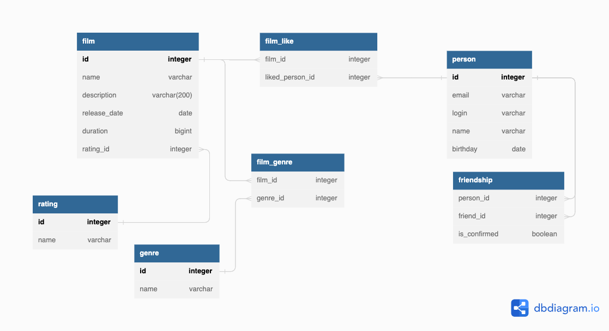

# java-filmorate
## ER diagram:

Query examples:

DELETE FROM film_like 
WHERE film_id = 1 AND liked_person_id = 3;

SELECT * FROM genre;

SELECT COUNT(*) FROM rating;

INSERT INTO person (email, login, name, birthday)
VALUES('test@ya.ru', 'cattt', 'Murzik', '2000-09-09');

## Распределение задач:
* Функциональность "Отзывы" - Екатерина Куликова
* Функциональность "Общие фильмы" - Сергей Лисовский
* Удаление фильмов и пользователей - Екатерина Куликова
* Функциональность "Рекомендации" - Елена Пасека
* Добавление режиссеров в фильмы - Светлана Сафронова
* Функциональность "Лента событий" - Кирилл Жуков, Екатерина Куликова, Сергей Лисовский
* Функциональность "Поиск" - Елена Пасека, Светлана Сафронова
* Вывод самых популярных фильмов по жанру и годам - Сергей Лисовский